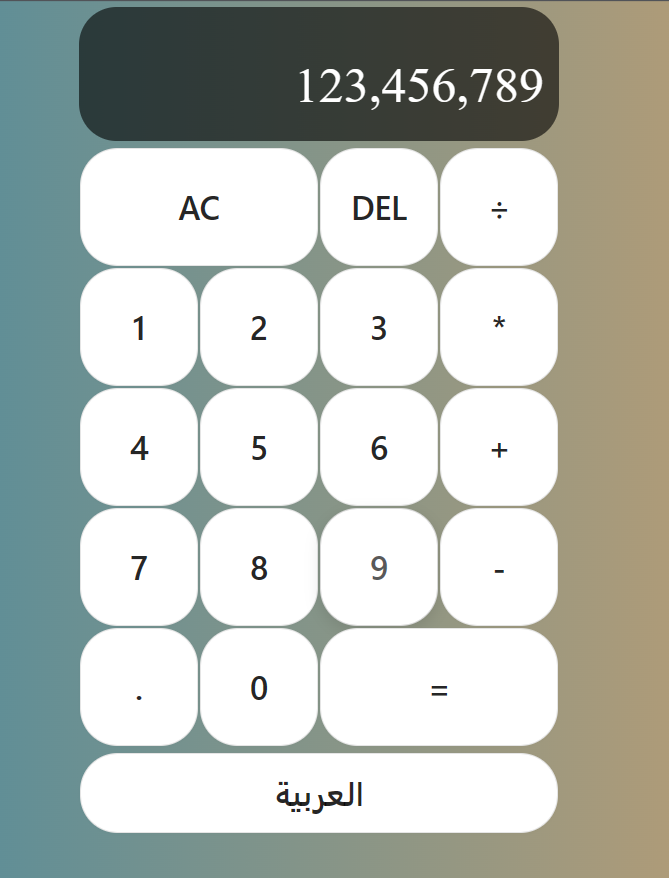
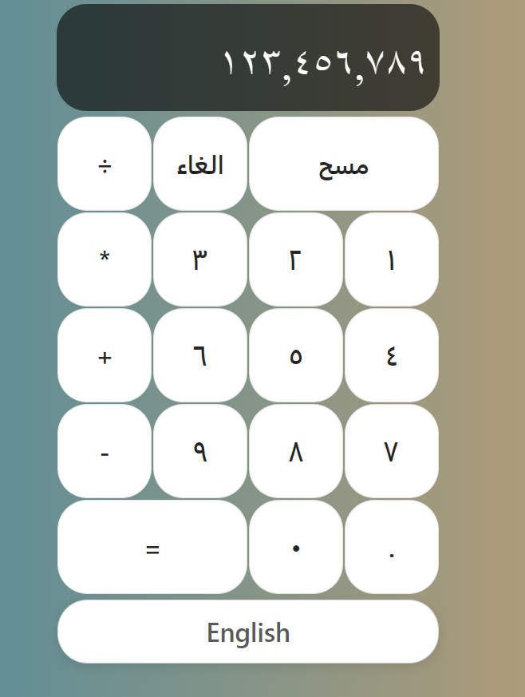

# Caculator

A simple calculator that is switchable between Arabic and English made using react js.

- Used i18next for localization.
- Used useSound to add a click sound to language switch button.

# Screenshots

English UI:



Arabic UI:



## Running

Install all the dependencies;

```bash
npm install
```

Then run:

```bash
npm start
```
